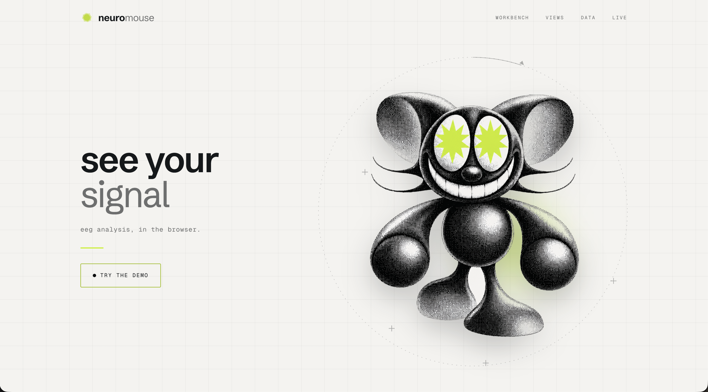
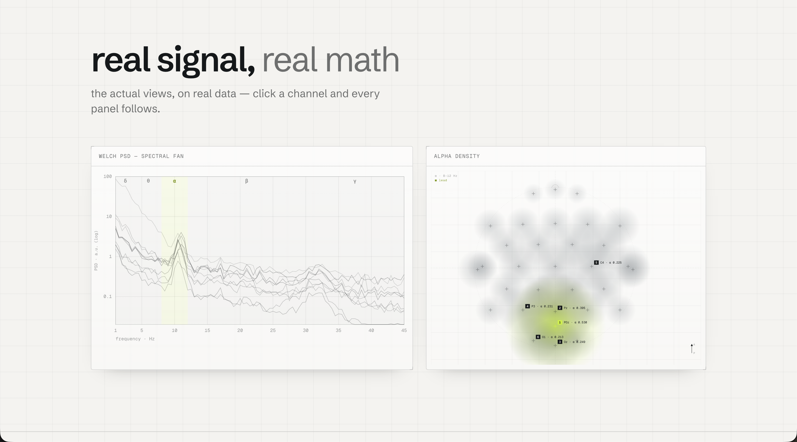
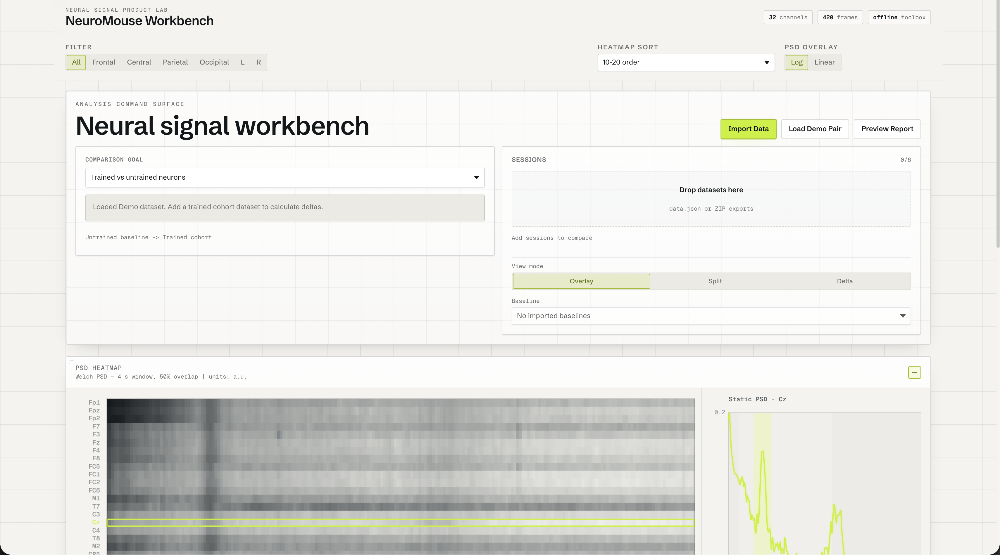
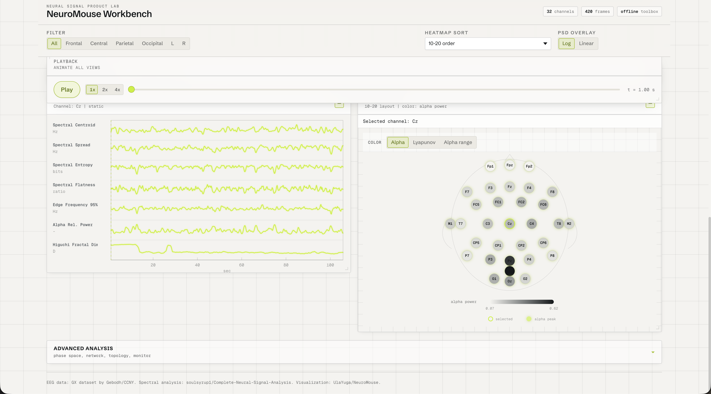

# NeuroMouse

NeuroMouse is a zero-build browser workbench for EEG and neural signal analysis exports, cohort comparison, report generation, and optional live raw EEG WebSocket frames. It translates saved `data.json` files, exported Welch PSD, spectral centroid, sliding spectral geometry, channel summary arrays, and browser-computed live DSP into interactive canvas/SVG views.

The dashboard stays browser-native: no Python in the browser, no framework, and no required runtime service for static replay. ZIP session import uses JSZip from CDN.

The viewer is montage-agnostic: any channel count and channel names are accepted. The data interface between a Python backend and this viewer is documented in [DATA_CONTRACT.md](./DATA_CONTRACT.md).

Production: https://neuromouse.up.railway.app

Custom domain target: https://neuromouse.ai

## Screenshots



<table>
<tr>
<td width="50%"></td>
<td width="50%"></td>
</tr>
<tr>
<td><sub><b>Landing</b> — the real views on real data; click a channel and every panel follows.</sub></td>
<td><sub><b>Neural Workbench</b> — file import, cohort comparison, and the Welch PSD heatmap.</sub></td>
</tr>
<tr>
<td width="50%"></td>
<td width="50%"></td>
</tr>
<tr>
<td><sub><b>Analysis</b> — synchronized playback, sliding spectral geometry, and the 10-20 channel head map.</sub></td>
<td></td>
</tr>
</table>

## Views

- Neural Workbench: file import, curated toolbox coverage, cohort comparison goal, analysis pipeline, summary metrics, and markdown report export.
- PSD Heatmap: Welch PSD by frequency and channel, plus a selected-channel overlay.
- Centroid Over Time: one line per channel with synchronized channel selection.
- Geometry Stack: six sliding spectral metrics for the selected channel.
- Channel Grid: 10-20 head map when channel names match it, otherwise a generic grid, colored by alpha relative power.
- Playback: synchronized scrubber and speed controls for animated replay.
- Phase Space: delay embedding and two-metric trajectories for the selected channel.
- Advanced views: polar alpha chronomap, Kuramoto phase animation, channel network, TDA persistence, and closed-loop monitor when the backing data exists.
- Live Source: optional `ws://127.0.0.1:8766` raw EEG frames from a soulsyrup1-style backend, analyzed in a browser Web Worker.

Click a channel row, line, or electrode to update every view.

## Controls

- Frequency bands are highlighted on PSD views: delta, theta, alpha, beta, gamma.
- PSD overlay can switch between log and linear scale.
- Channel filters support region and hemisphere scopes.
- Heatmap rows can be sorted by 10-20 order, alpha power, or centroid.
- Centroid and geometry hover crosshairs are synchronized.
- Centroid hover shows top and bottom channel rankings at that timestamp.
- Channel grid marks channels with a clear alpha peak.
- Session comparison imports up to six saved datasets and supports overlay, split, and delta views.
- Offline import accepts NeuroMouse `data.json`, combined CSV export ZIP, or a paired Welch + geometry ZIP set.
- Collapsible panels keep dense analysis sections reachable without flooding the first viewport.

## Run Locally

The committed `data/data.json` is enough to run the dashboard — no conversion step is needed for the demo dataset.

```bash
npm start
```

This runs `node server.mjs` (the same runtime used in production) and serves on `http://localhost:8080`. Any static file server also works, for example `python3 -m http.server 8000`.

## Live Mode

Live mode is optional. Run a soulsyrup1-style raw EEG backend separately that emits frames on `ws://127.0.0.1:8766`, then enable the dashboard's Live Source controls.

The dashboard accepts raw sample payloads on `ws://127.0.0.1:8766`, defaults to 32 channels at 256 Hz, and uses backend metadata when available. Supported payloads include Float32 binary frames, JSON one-sample arrays, JSON sample-major chunks under `samples`/`data`/`values`, and channel-major JSON objects under `samples_by_channel`.

Live mode computes Welch PSD, centroid, spread, entropy, flatness, edge95, and alpha relative power in `js/workers/dsp-worker.js`. If the backend is unavailable or a payload cannot be parsed, the dashboard stays in static replay mode.

## Data Conversion

The converter expects two local source archives in the ignored source data folder:

- `eeg_welch_export.zip`
- `spectral_centroid_export.zip`

It writes `data/data.json`, which is committed for static hosting.

## Attribution

See [ATTRIBUTION.md](./ATTRIBUTION.md).
