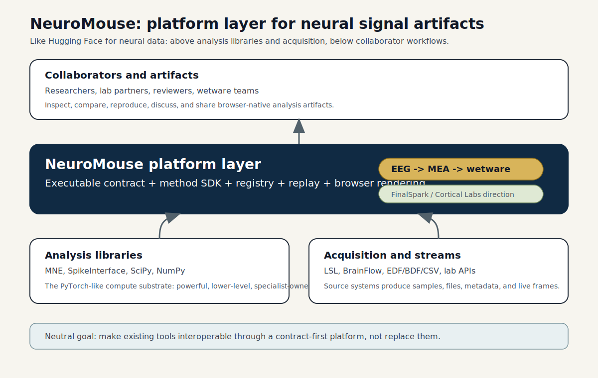

# NeuroMouse Positioning

NeuroMouse should be explained first as a wetware and MEA collaboration layer. The useful
niche is not "another EEG dashboard"; it is a platform surface where organoid, cultured
neuron, MEA, and adjacent neural-signal work can be normalized, replayed, analyzed, and
discussed without forcing every collaborator into the same local Python stack.

EEG remains useful as an early, familiar data path and compatibility proof. The strategic
center is wetware: labs working near FinalSpark, Cortical Labs, and related MEA systems need
clear dataset contracts, analysis templates, bring-your-own-sorter boundaries, and browser
artifacts that make dense channel data reviewable by scientists, engineers, and reviewers.

The closest analogy is the Hugging Face layer in machine learning:

- PyTorch and TensorFlow are powerful libraries.
- Hugging Face makes models, datasets, pipelines, cards, hosted demos, and reproducible
  usage patterns legible to a wider group.
- NeuroMouse should do that for neural signal data, methods, and interactive collaborator
  artifacts.

For neurotechnology, the lower-level library layer is MNE, SpikeInterface, SciPy, NumPy,
BrainFlow, LSL, and lab-specific acquisition stacks. NeuroMouse sits above that layer as the
contract, method, replay, and presentation surface.

## Short Positioning Statement

NeuroMouse is a wetware-oriented platform layer for MEA-scale neural signal datasets and
analysis methods. It accepts MEA, organoid, cultured-neuron, EEG, and wetware-adjacent data
from acquisition and analysis tools, normalizes it through an executable contract, runs
declared methods, and renders collaborator-ready interactive artifacts in the browser.

## What It Is

- A contract-first bridge between acquisition, analysis, service, and UI layers.
- A method SDK and registry for small declared analysis plugins such as spike detection,
  network burst summaries, and connectivity measures.
- A browser-native replay and inspection surface that does not require collaborators to run
  Python.
- A path for wetware scientists to pair NeuroMouse templates with their own sorter or lab
  pipeline while keeping outputs comparable.
- A bridge from existing EEG evidence into MEA and wetware data from ecosystems such as
  FinalSpark and Cortical Labs.

## What It Is Not

- Not a replacement for MNE, SpikeInterface, SciPy, or NumPy.
- Not an acquisition protocol competing with LSL or BrainFlow.
- Not only a static EEG dashboard.
- Not a black-box analytics service with hidden data assumptions.

## Landscape

| Layer | Examples | NeuroMouse role |
| --- | --- | --- |
| Acquisition | MEA recorders, lab APIs, LSL, BrainFlow, EDF/BDF/CSV exports | normalize into canonical datasets |
| Analysis libraries | SpikeInterface, MNE, SciPy, NumPy, lab sorters | remain the low-level compute substrate |
| Platform layer | NeuroMouse | contract, method templates, registry, replay, browser artifact |
| Collaborators | researchers, labs, reviewers, wetware teams | inspect, compare, reproduce, and discuss |

The key strategic choice is to stay neutral. NeuroMouse should make upstream tools easier to
use together, not force a new lab stack.

## Span: EEG To MEA And Wetware

The contract is montage-agnostic and channel-major. That lets the same platform language
cover:

- conventional EEG montages with human-readable channel names
- high-density EEG and MEA layouts with hundreds or thousands of channels
- file replay and live streams
- wetware-adjacent datasets from organoid and cultured-neuron systems
- method outputs such as detected spikes, burst windows, and connectivity tables

The default 4096-channel ceiling is a safety control, not a scientific boundary. It keeps
browser and service paths from accepting unbounded payloads while leaving room for
high-density MEA work.

The model is "templates plus bring your own sorter." NeuroMouse should provide the contract,
method declarations, review surfaces, and example wetware analyses. Labs keep their validated
sorter, whether it is a SpikeInterface pipeline, a vendor export, a custom notebook, or a
future package under `packages/sorting`. The boundary is declared output, not one blessed
spike-sorting implementation.

## Collaborator Message

When showing this to collaborators, lead with the artifact:

1. The viewer already renders canonical datasets in the browser.
2. The contract is executable in Python and consumable in TypeScript.
3. Methods are declared plugins, not hidden scripts.
4. MEA and wetware are the foreground use case, not an afterthought.
5. The platform can sit above existing analysis, acquisition, and sorting tools.
6. The roadmap is wetware-first while preserving EEG compatibility, without locking labs into
   one stack.
